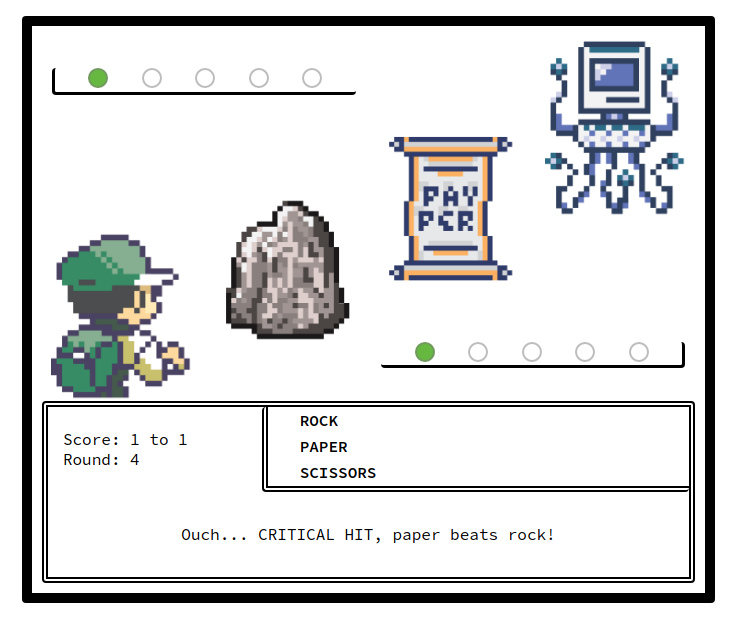

# RPG-roshambo

Taking the game of Roshambo (rock/paper/scissors) to the next level, with inspiration from a popular 90's handheld adventure game. Using the rules of [Rock Paper Scissors](https://en.wikipedia.org/wiki/Rock_paper_scissors), you battle against the computer on your quest to become the very best, like no one ever was.

First to win 5 rounds takes the trophy!

## Example
[Check it out in action](https://jmilll.github.io/RPG-roshambo/)

## Motivation

The purpose of this project was to learn and understand Javascript events and manipulation of the Document Object Model (DOM) through user interactions.

## Technologies Used

* JavaScript
* HTML / CSS

## Features

* Rock, paper, scissors, with the click of a button.
* Select your 'attack' method and go up against the cpu's random selection.
* Balls update with the score for visual representation of your progress.
* Sprites update to match user and cpu selection.
* Winning and losing screens.
* Option to replay to reset everything and battle again.
* Super cool sprites.

## Acknowledgements

This project was inspired by [The Odin Project](https://www.theodinproject.com/home) online learning curriculum.
This project was also inspired by a late 90's battle adventure game where you tried to collect 'em all, then battle to be the very best, like no one ever was.

## License

MIT